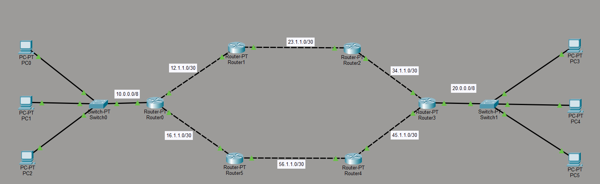
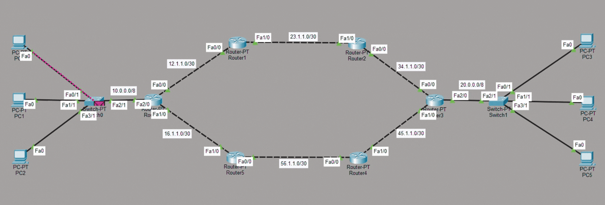

# Multi-Router Administrative Distance Project (Cisco Packet Tracer)

This project demonstrates static routing with subnetting in a ring topology.
Using Administrative Distance, I forced packets to travel in clockwise direction from sender to receiver.
For return traffic, I configured a different static route with different AD, so reply packets use another path.
This shows route prioritization and path control using static routing

---
## 📸 Network Topology Preview

### 🗺 Topology Diagram

 - Lan Connection
   * PC1 ----- SW1 ----- 10.0.0.0/8 ----- R1
   * R1 ----- 20.0.0.0/8 ----- SW2 ----- PC2
 - WAN Router Connections
   * R1 --- 12.1.1.0/30 --- R2
   * R2 --- 23.1.1.0/30 --- R3
   * R3 --- 34.1.1.0/30 --- R4
   * R4 --- 45.1.1.0/30 --- R5
   * R5 --- 56.1.1.0/30 --- R6
   * R6 --- 16.1.1.0/30 --- R1


### Live Packet Flow (Simulation Mode)


 - Packets are shown moving hop-by-hop using ICMP in Simulation Mode.
---
## Tasks Performed in This Project
  1. Assign all IP addresses as per the topology.
  2. Configure static routes in a clockwise direction.
  3. Ensure the traffic path follows:
     * R1 → R2 → R3 → R4 → R5 → R6 → R1
  4. Assign IP addresses to PCs manually (no DHCP).
  5. Verify that all devices are reachable from one another using:
      ```text
      ping
      tracert
      show ip route
      ```
## 📂 Project Structure
```text
Static-Routing-Packet-Tracer/
│
├── project.pkt
│
├── assets/
│   ├── topology.png
│   └── simulation.png
│
└── README.md
```
