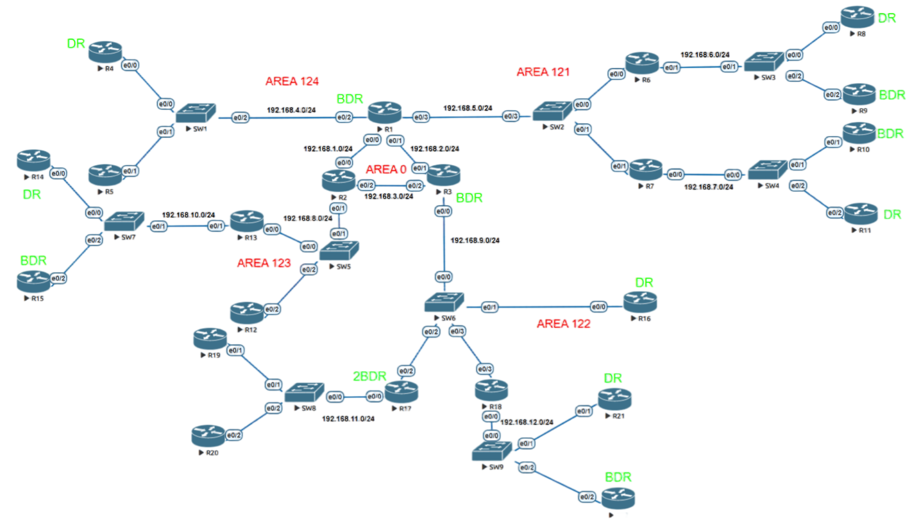

# OSPF Multi-Area Network Lab

## Overview

This project demonstrates the implementation of a large-scale OSPF multi-area network using 
Cisco IOS routers in EVE-NG. The topology consists of **22 routers** interconnected across 
multiple OSPF areas, simulating an enterprise-level hierarchical network design.

## Network Topology



## OSPF Areas

| Area | Description |
|-----|-------------|
| Area 0 | Backbone area connecting ABRs |
| Area 121 | Distribution network |
| Area 122 | Extended routing domain |
| Area 123 | Remote branch topology |
| Area 124 | Access network segment |

## Router Roles

- **ABR Routers:** R1, R2, R3
- **DR / BDR routers** configured using `ip ospf priority`
- **Internal routers** within each area

## Technologies Used

- Cisco IOS
- OSPFv2
- Multi-Area OSPF Design
- DR / BDR Election
- EVE-NG Network Emulator

## Configuration Features

- OSPF Area segmentation
- Backbone area connectivity
- DR / BDR election
- Inter-area routing
- Hierarchical network design

## 📂 Project Structure
```text
OSPF-MultiArea
│
├── topology
│     └── ospf-multi-area-topology.png
│
├── lab-file
│     └── OSPF_MultiArea.unl
│
├── configs
│     ├── R1.txt
│     ├── R2.txt
│     ├── R3.txt
│     ├── ...
│     ├── R22.txt
│     └── ReadMe.md
│
└── README.md
```

## Verification Commands
```
show ip ospf neighbor
show ip route ospf
show ip ospf database
show ip ospf interface
```
